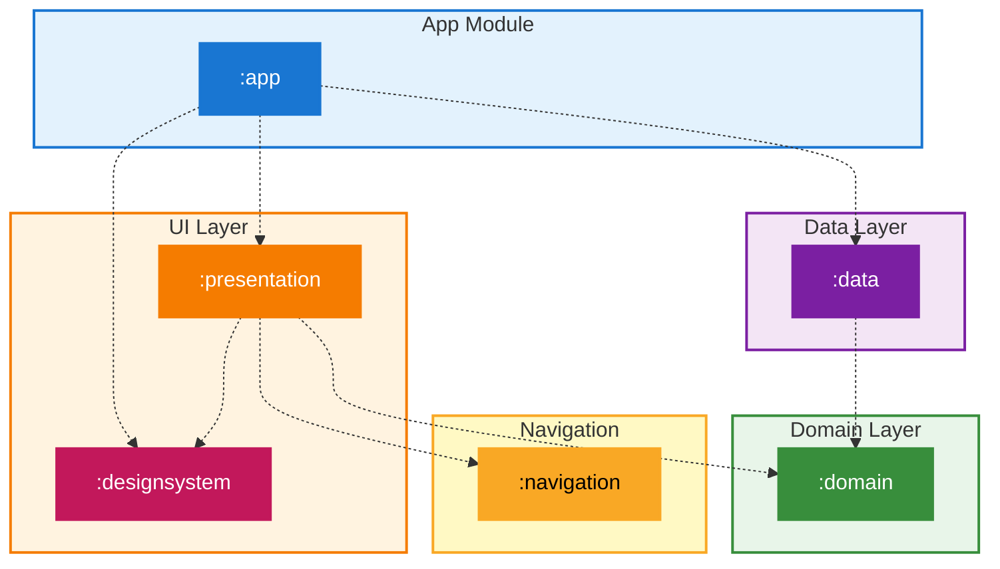

# 플랜핏 스플래시 ~ 온보딩 구현 (컴포즈)

---

## 모듈 구조

- **App** 
  - 모든 모듈 통합
  - hilt 설정

- **Presentation**
  - 컴포즈 UI 화면 담당
  - UI 상태 관리

- **data**
  - repository 구현체 포함
  - 데이터 소스(local, remote)
  - mapper를 통한 데이터 매핑

- **domain**
  - 비즈니스 로직 + entity
  - UseCase, repository 인터페이스 포함

- **navigation**
  - 화면 라우팅 정의, 화면 전환 로직 포함
  - 네비게이션 그래프
  - presentation 모듈에서 사용
  - route 정의 중앙 집중화, Type Safety 네비게이션 구현을 위해 navigation 모듈 정의

- **designsystem**
  - 테마(Color, Typo, Shape), 커스텀 컴포저블 포함

## 앱 스펙

- 실제 앱은 카카오, 애플, 구글, 페북 로그인이 있지만 로그인은 생략하고 UI만 최대한 비슷하게 구현
- 내부 표시되는 데이터는 하드코딩
- 장소 검색 api는 시간 나면 구현. 일단 입력값 여부 검증까지만 구현
- ref : https://wwit.design/2023/07/24/planfit/

## 화면 스펙 간단하게

1. 스플래시
2. 로그인 화면 (실제 로그인 로직 생략)
3. 온보딩 1 : 운동 수준 선택(입문, 초급, 중급, 고급, 전문가)
4. 온보딩 2 : 운동 장소 선택(헬스장, 집)
5. 온보딩 3 : 헬스장 설정
6. 온보딩 3-1 : 검색한 역 인근 헬스장 리스트로 표시. 온보딩 3과 같은 화면
7. 온보딩 3-2 : 헬스장 선택 시 다니는 게 맞냐는 확인 바텀 시트 팝업
   - 헬스장 이름, 도로명 주소, 우편번호, [다시 검색 / 네, 맞아요] 버튼 컨테이너 세로 배치
8. 온보딩 4 : 운동 목표(1주일에 몇 번 운동할거냐 - 1~6회)
9. 온보딩 5 : 신체 목표(평생 숙제 다이어트 / 뱃살, 옆구리살 빼기 / 팔뚝 군살 제거 등 grid chip 형태, 복수 선택 가능)
10. 온보딩 6 : 신체 정보(성별 - 남성, 여성, 기타)
11. 온보딩 7 : 신체 정보(생년월일, 키, 몸무게 입력)
    - numberpad 띄우고 생년월일 포맷팅은 낮은 우선순위
12. 온보딩 7-1 : 생년월일 선택 시 바텀 시트에 스크롤형 피커 표시 - 연월일 각각 선택 후 확인 클릭 시 바텀 시트 제거, 선택값 표시
13. 온보딩 8 : 추가 질문(알게 된 경로 - 인스타그램/페이스북, 기타, 유튜브, 지인 추천, 블로그/카페/커뮤니티)
14. 온보딩 9 : 알림 권한 요청 화면(시스템 권한 팝업 표시, 어떤 걸 골라도 다음 화면으로)
15. 온보딩 10 : 운동 루틴 선택 화면(Day 1, Day 2, Day 3 / 1개만 선택 가능)
16. 온보딩 11 : 맞춤 루틴 구성 중 로딩 화면
17. 온보딩 12(fin) : 구독 유도 화면